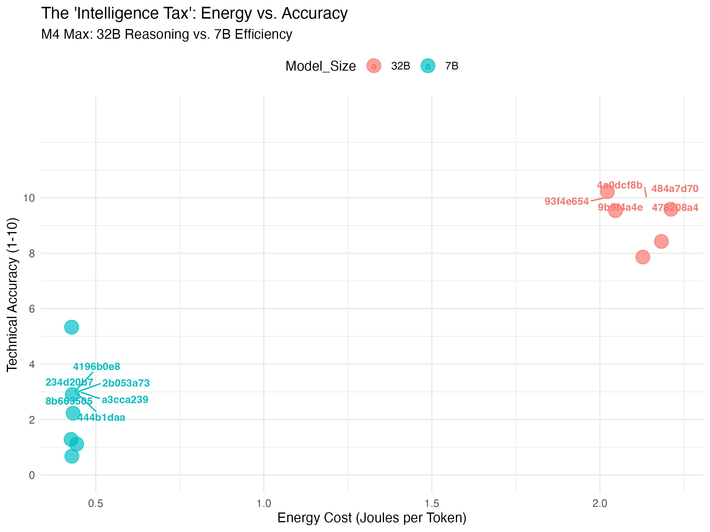

# Local LLM Energy Benchmarking on Apple Silicon (M4 Max)

This project evaluates the efficiency and technical reasoning capabilities of local Large Language Models (LLMs) using hardware-level energy telemetry. By comparing **Qwen 2.5 Coder 7B and 32B**, this study quantifies the "Intelligence Tax"—the energy cost required for high-fidelity technical reasoning.

## Key Features
* **Real-time Energy Tracking:** Leverages `zeus-apple-silicon` to measure actual hardware draw across CPU, GPU, and ANE domains.
* **Dual-Stream Logging:** Separates quantitative metrics (Joules, Tokens) from qualitative responses to ensure data integrity.
* **Hardware-Specific Profiling:** Tailored for the M4 Max Unified Memory architecture and Metal/MLX performance.

---

## Benchmark Results

| Model | Efficiency (J/Tok) | Avg. Total Energy (J) | Technical Score | Primary Use Case |
| :--- | :---: | :---: | :---: | :--- |
| **Qwen 2.5 7B** | ~0.45 | ~295 | 3/10 | Low-latency, basic scripts |
| **Qwen 2.5 32B** | ~2.14 | ~3823 | 10/10 | Complex math, Metal/MLX optimization |
| **Idle Baseline** | N/A | 0.08 J/s | N/A | Background system draw |

### Visual Analysis

*Figure 1: Comparison of Reasoning Accuracy vs. Energy Cost.*

---

## Project Findings: M4 Max LLM Performance

* **Efficiency Threshold:** The 7B model achieved a **~5x improvement** in energy efficiency, consuming only ~0.45 J/Token.
* **The Capability Gap:** Despite its efficiency, the 7B model failed to produce valid Metal/MLX code for 3D fractal rendering, often hallucinating non-existent Python libraries.
* **Hardware Optimization:** The 32B model utilized the **M4 Max Unified Memory** significantly more effectively for long-context generation, maintaining a "Quality-per-Joule" score that justifies its higher power draw for systems engineering.

---

## Tech Stack
* **Inference:** Ollama (Local)
* **Analysis:** R (ggplot2, dplyr, ggrepel)
* **Hardware Telemetry:** `zeus-apple-silicon`
* **Language:** Python 3.12+

---

##  Installation & Usage

```bash
# Clone the repository
git clone [https://github.com/HoldenHrabak/llm-benchmarking.git](https://github.com/HoldenHrabak/llm-benchmarking.git)
cd llm-benchmarking

# Setup Environment
python3 -m venv venv
source venv/bin/activate
pip install ollama zeus-apple-silicon pandas

# Run Benchmark (Requires sudo for hardware sensors)
sudo ./venv/bin/python monitor_energy.py
